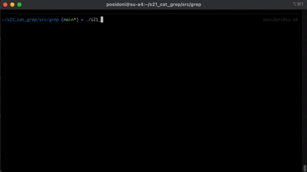

# S21_Cat & S21_Grep

## Table of contents
* [General info](https://github.com/MikhailKuzntsov1/s21_cat_grep/tree/main#general-info)
* [Goal & requirements](https://github.com/MikhailKuzntsov1/s21_cat_grep/tree/main#goal--requirements)
* [Key learnings](https://github.com/MikhailKuzntsov1/s21_cat_grep/tree/main#key-learnings)
* [Build & usage](https://github.com/MikhailKuzntsov1/s21_cat_grep/tree/main#build--usage)
   * [Build](https://github.com/MikhailKuzntsov1/s21_cat_grep/tree/main#build)
* [s21_cat] (https://github.com/MikhailKuzntsov1/s21_cat_grep/tree/main#s21_cat)
   * [s21_cat usage](https://github.com/MikhailKuzntsov1/s21_cat_grep/tree/main#s21_cat-usage)
   * [s21_cat options](https://github.com/MikhailKuzntsov1/s21_cat_grep/tree/main#s21_cat-options)
   * [s21_cat tests](https://github.com/MikhailKuzntsov1/s21_cat_grep/tree/main#s21_cat-integration-tests)
* [s21_grep] (https://github.com/MikhailKuzntsov1/s21_cat_grep/tree/main#s21_grep)
   * [s21_grep usage](https://github.com/MikhailKuzntsov1/s21_cat_grep/tree/main#s21_grep-usage)
   * [s21_grep options](https://github.com/MikhailKuzntsov1/s21_cat_grep/tree/main#s21_grep-options)
   * [s21_grep tests](https://github.com/MikhailKuzntsov1/s21_cat_grep/tree/main#s21_grep-integration-tests)
* [Credits](https://github.com/MikhailKuzntsov1/s21_cat_grep/tree/main#credits)

## General info 

Implementation of GNU `cat` and BSD `grep` with all major flags and flags combinations.

## Goal & requirements

The goal of this project was to learn & replicate the functionality of the GNU cat & 
BSD grep, including all major flags and their combinations. There must be integration tests
that compare original programs with our versions.

There also had to be no constant size buffers / arrays for handling files contents. Thus, I had to
implement linked list API for storing all collected grep patterns with `-f` and `-e` flags.

## Key learnings
- Working with regular expressions in C
- Files IO in C
- `Errno & error handling in C
- grep / cat usage knowledge
- PCRE syntax
- Working with `argv / argc`, CLI args parsing

## Build

```
$ git clone git@github.com:MikhailKuzntsov1/s21_cat_grep.git
$ cd repo/src/
$ make
```

## S21_cat

### s21_cat Usage

`$ s21_cat [OPTION] [FILE]...`

### s21_cat Options

| No. | Options | Description |
| ------ | ------ | ------ |
| 1 | -b (GNU: --number-nonblank) | numbers only non-empty lines |
| 2 | -e implies -v (GNU only: -E the same, but without implying -v) | but also display end-of-line characters as $  |
| 3 | -n (GNU: --number) | number all output lines |
| 4 | -s (GNU: --squeeze-blank) | squeeze multiple adjacent blank lines |
| 5 | -t implies -v (GNU: -T the same, but without implying -v) | but also display tabs as ^I  |

### s21_cat integration tests

s21_cat fully replicates original GNU cat functionality, including all flags and flags combinations. 

Integration tests are launched via python script 's21_cat_test.py'. Before launching tests s21_cat executable must be built. There are about ~500 possible unique tested combinations.

```
$ python3 cat/s21_cat_tests.py
```

<div align="center"></div>
<div align="center"><sub>s21_cat integration tests</sub></div>

## S21_grep

### s21_grep Usage

`s21_grep [options] template [file_name]`

### s21_grep Options

| No. | Options | Description |
| ------ | ------ | ------ |
| 1 | -e | pattern |
| 2 | -i | Ignore uppercase vs. lowercase.  |
| 3 | -v | Invert match. |
| 4 | -c | Output count of matching lines only. |
| 5 | -l | Output matching files only.  |
| 6 | -n | Precede each matching line with a line number. |
| 7 | -h | Output matching lines without preceding them by file names. |
| 8 | -s | Suppress error messages about nonexistent or unreadable files. |
| 9 | -f file | Take regexes from a file. |
| 10 | -o | Output the matched parts of a matching line. |

### s21_grep integration tests:

s21_grep replicated major BSD grep (2.5.1-FreeBSD) flags and their combinations listed above. s21_grep uses PCRE syntax and regex engine provided by the developers of `regex.h`.

Integration tests are launched via python script 's21_grep_test.py'. Before launching tests s21_grep executable must be built. There are about ~180k tests, without `-o` flag there is full compatibility with BSD grep.

```
$ python3 cat/s21_cat_tests.py
```

<div align="center"></div>
<div align="center"><sub>s21_grep integration tests</sub></div>

## Credits
- Developer: [Mikhail Kuznetsov (@posidoni)](https://github.com/MikhailKuzntsov1)
- I greatly appreciate the support of [Stepan Fedorov (@nanadaug)](https://github.com/co-cy) & others for providing great python scripts for integration testing
- SC21 for providing this task as a part of our curriculum 🙂💚
